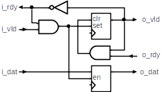
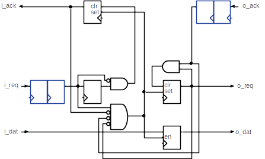
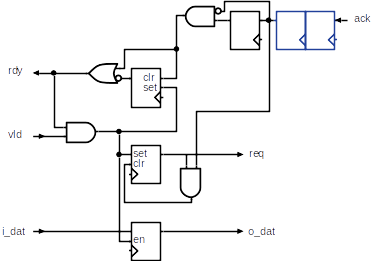
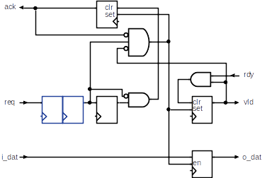
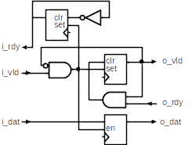

Handshake Protocols
===================

This work is licensed under a [Creative Commons Attribution 4.0 International License](http://creativecommons.org/licenses/by/4.0/).

A *handshake protocol* or simply a *handshake* in digital circuits is a set of control signals and
definition of their interaction to pass data from a producer to a consumer.
Most often, ad hoc handshake schemes work best in terms of latency and
design clarity. Sometimes, though, it is useful to turn to well defined
protocols with known properties, especially when used at the IP block
boundary.

This document describes two such handshakes, one called *Ready--Valid* and the
other called *Request--Acknowledge*. Typical uses, conversion from one to
the other and to other typical interfaces is discussed.

General Discussion
------------------

In the most general case, passing data from a producer to a consumer takes two
events. *Request* is the event, by which the producer signals availability of
data, and *response*, by which the consumer signals it has taken the data.

The handshake protocol then defines how to represent those two events. Schemes
differ in terms of latency and complexity of handshaking. A well defined scheme
ensures that neither side can be mistaken about each event and hence avoid data
loss. Such a scheme can be chained in a producer/consumer pipeline such that
only readiness of the starting and the ending elements of the pipeline defines
the overall throughput.

In certain cases, the two events can be reduced to a single one, e.g. when the
producer or the consumer is mostly ready. A practical example may be a FIFO,
which on the input side can accept new data any time up to its capacity; on
the output side it can provide data unless it becomes depleted. In those cases,
the single event, *take* or *get*, is often conditioned by the state of the
other side.

Ready--Valid Handshake
----------------------

In this scheme, the consumer signals *ready* when it can accept new data and
the producer indicates *valid* when there it has new data available. Each side
signals its willingness of transfer independently of the other side. Data is
then transferred whenever both ready and valid are true. 

The *request* and *response* events then alias into the same event. In this
perspective, the scheme can transfer new data every clock cycle and can be
though of as a *one phase* handshake. Like if you wanted to chain two FIFOs.

In practice, one or the other side will often follow the transfer by clearing
its readiness status. This would be like a *two phase* handshake and would
decrease the protocol throughput to at least two clocks per data transfer.

An example is shown on the following pipeline stage, where both the input and output
side implement the Ready--Valid handshake.

Notice that the implementation is such that all output control signals (i.e.
`i_rdy` and `o_vld`) originate from a flop internal to the module. This makes
sure to split a combinational path that might have otherwise gone through the
pipeline stage.

Request--Acknowledge Handshake
------------------------------

In this scheme, the producer requests a new transfer and the consumer
responds with acknowledging the transfer. Here the consumer reacts only in
response to the producer. Also, the state of the *Request* and *Acknowledge*
remains stable until the other side reacts.

Hence the Request--Acknowledge scheme can be used as a *two phase* or a
*four phase* handshake. In a two phase scheme, a transition on Request represents
the first phase and transition on Acknowledge represents the second phase. In
the four phase handshake, each logic combination of the two signals represents
one phase.

The circuit below shows an example of a pipeline stage for the four phase
handshake. Again, each of the output control signals originates from a flop
to split signal paths going through the pipeline stage.

Comparing the Schemes
---------------------

The Ready--Valid scheme is particularly useful when the producer and consumer
run from the same clock. It is simpler and faster.

The Request--Acknowledge has advantages when crossing clock domains and hence
when the producer and consumer run from different clocks. The fact that request
and response events are tied to transitions on Request and Acknowledge, there
can be no mistaking in detecting the event even with synchronizers on the
control signals. The phasing then ensures that data remain stable long enough.

The latter scheme is also somewhat easier for arbitration of multiple producers
to a single consumer. This comes from its *pull* type nature; while the Ready--Valid
scheme is more a *push* type protocol.

Converting the Schemes
----------------------

Due to their different properties, designers may choose to combine both schemes
in the design and hence would need to convert from one to the other. The following
circuits provide such conversion.

Variances
---------

There can be variances of the two schemes introduced above.

### Valid--Ready Handshake ###

The Ready--Valid scheme represented by the pipeline stage circuitry above is
a *push* type in the sense that *Ready* foreruns *Valid*. This is a part of
the protocol and the producer may rely on this by not signaling valid until
it sees the consumer ready.

The *Valid--Ready* handshake is the opposite, where Valid foreruns Ready and
now it is the consumer who expects the producer to signal Valid before signaling
Ready and hence acting like a *pull* type handshake. The corresponding pipeline
stage is shown below.

Note that the pull type and push type pipeline stages cannot be combined.

### Request--Acknowledge Strobe Handshake ###

A variant of a two phase Request--Acknowledge handshake is a form where both
the request and acknowledge events are represented by single cycle strobes.
This for may be useful for producers and consumers in the same clock domain
and also may prove a bit simpler when directly interfacing to a finite state
machine. But else it provides no extra benefits.

